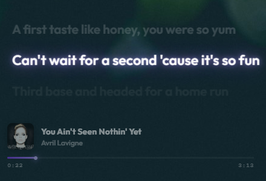

# AeroLyrics 🎵

<p align="center">
  
</p>

AeroLyrics is a frameless, floating Spotify lyrics widget built for Windows. It strictly follows the currently playing Spotify track and displays highly accurate synchronized lyrics on the desktop. It is designed to be unobtrusive and customizable, catering to power users who want a seamless desktop lyric experience.

## ✨ Features

- **Real-Time Sync**: Fetches and synchronizes lyrics with the currently playing Spotify track via the LRCLIB API with **Zero-Tolerance** duration matching to ensure 100% accurate lyrics.
- **Manual Sync Adjustment**: Built-in visual controls to advance or delay lyric timing with millisecond precision, dynamically cached for future playback.
- **Global Keyboard Shortcuts**: Control lyric sync globally (`Ctrl + Alt + Left/Right`) even when the widget is in Click-Through mode and running in the background.
- **Aggressive Always-On-Top**: Uses Windows `screen-saver` level priority to ensure the widget stays on top of borderless full-screen applications and games.
- **Ghost Mode (Click-Through)**: Toggleable Click-Through mode via IPC to allow mouse events to pass through the Electron window directly into the applications behind it.
- **Karaoke-Style Static Lyrics**: Static lyrics implementation in React with dynamic opacity fading based on the active lyric index, ensuring no overflow bounds.
- **Persistent OAuth Session**: Bulletproof background token refresh flow using PKCE in the main process to maintain the Spotify session indefinitely without sudden logouts.
- **Main Process Caching**: Network requests, downloaded lyrics, and user offset preferences are cached in the Node.js main process to dramatically improve performance.
- **Dynamic Transparency**: Real-time adjustable background opacity controlled via the System Tray context menu.
- **Smart Window Boundaries**: Built-in boundary detection that prevents the frameless window from being dragged off-screen or lost on multi-monitor setups.
- **Persistent State Management**: Automatically saves and restores the widget's exact screen coordinates and opacity settings across application restarts.
- **Frameless Dragging**: Implements seamless window dragging directly from the React UI using `-webkit-app-region: drag`.

## 🛠️ Tech Stack

- **Framework**: Electron + React + Vite
- **Language**: TypeScript
- **Styling**: Vanilla CSS (No UI frameworks, ensuring minimal bundle size)
- **APIs**: Spotify Web API (OAuth & Player State), LRCLIB API (Synced Lyrics)

## 🚀 Development Setup

### Prerequisites
- [Node.js](https://nodejs.org/) (v18 or higher)
- A Spotify Developer Account to create an OAuth Client ID (Requires `user-read-currently-playing` and `user-read-playback-state` scopes).

### Installation

1. Clone this repository:
```bash
git clone https://github.com/v-vabyo/AeroLyrics.git
cd AeroLyrics
```

2. Install dependencies:
```bash
npm install
```

3. Environment Configuration:
Create a `.env` file in the root directory and add your Spotify Client ID:
```env
VITE_SPOTIFY_CLIENT_ID=your_spotify_client_id_here
```

### Available Scripts

- `npm run dev`: Starts the application in development mode with hot-reloading (Vite).
- `npm run build`: Compiles TypeScript and builds the application for production.
- `npm run package`: Packages the built application into a Windows `.exe` installer using `electron-builder`.

## 📂 Project Structure

- `src/main/`: Electron main process scripts (Window management, IPC handlers, OAuth flow, Token persistence, LRCLIB API calls).
- `src/renderer/`: React frontend (UI components, Spotify polling hooks, Lyric synchronization hooks).
- `src/preload/`: Context bridge exposing safe IPC methods to the renderer.

## 📜 License
This project is open-source. Lyrics are provided by the [LRCLIB](https://lrclib.net/) community.
